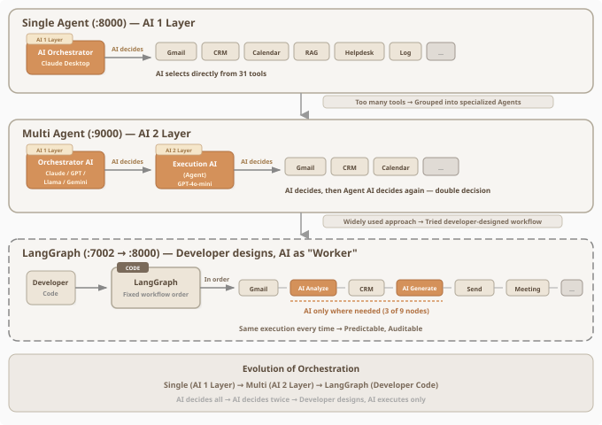

# MCP Multi-Agent Server

A **multi-domain multi-agent system** served over **MCP (Model Context Protocol)** with **FastMCP**. An **Orchestrator agent** analyzes each request, delegates to the right specialists among **6 domain agents** (email, CRM, calendar, customer support, helpdesk, reporting), hands data between them, and synthesizes the final answer — with a bilingual **Streamlit dashboard** for observability.

> Part of the **SunnyLab** build series — the step where the server stops being a flat bag of tools and grows a **team**. Before this, one agent held 15+ tools and the client chained them itself; here an in-server orchestrator owns the delegation across 6 agents of 3–6 tools each, so any client (Claude Desktop, Cursor, ADK web, LangGraph) gets the same multi-agent behavior. Sanitized public showcase — credentials and infrastructure identifiers removed; configure your own `.env`.


## Why two AI layers
The single-agent server put **31 tools in front of one model** and asked it to pick. That works until it doesn't: selection accuracy degrades as the tool list grows. Grouping the tools into specialized agents adds a second decision layer — the orchestrator picks the *agent*, the agent picks the *tool*.



The orchestrator can be any MCP-capable model — Claude, GPT-4o, Llama 3.1 running locally through Ollama, or Gemini via ADK — because the decision boundary is the protocol, not the vendor. Each agent's internal think → plan → execute loop runs on `gpt-4o-mini`.

## What it demonstrates
- **Orchestrator + specialist pattern** — LLM-driven routing, agent-to-agent handoff, result synthesis, all inside the MCP server
- **A shared `BaseAgent`** — each domain agent is the same contract with a different toolset, so adding a seventh is additive
- **RAG-backed agents** — CS (product docs) and Helpdesk (internal docs) answer from **ChromaDB**, not from model memory
- **RBAC with per-user service isolation** — identity arrives on the MCP URL and selects that user's own Gmail and Salesforce credentials; `admin` gets full access, `sales` is scoped to Gmail/Salesforce, `finance` to enterprise resources
- **Built-in observability** — logging middleware auto-records every tool call to SQLite, exposed through a log API and a bilingual Streamlit dashboard
- **Cloud-native delivery** — Docker, docker-compose, Cloud Build, GitHub Actions (project/VM values are placeholders)

## Architecture
```
MCP client (Claude Desktop / Cursor+GPT / Cursor+Llama / ADK / LangGraph)
        │  MCP over Streamable HTTP  (run_*_agent)
        ▼
┌─ cross-cutting ─────────────────────────────────────────────────────┐
│  User Identification    Logging Middleware     Dynamic Permission   │
│  URL param → user_id    auto-record all calls  admin/sales/finance  │
└─────────────────────────────────────────────────────────────────────┘
   Orchestrator  — context analysis → agent selection → data routing
        ├─ Email Agent      (Gmail)                  3–6 tools each,
        ├─ CRM Agent        (Salesforce)             each with its own
        ├─ Calendar Agent   (Google Calendar)        OpenAI think → plan
        ├─ CS Agent         (product docs · RAG)     → execute loop
        ├─ Helpdesk Agent   (internal docs · RAG)
        └─ Report Agent     (log analysis / stats)
                │
        service layer  ──►  Gmail · Salesforce (JWT) · Calendar · OpenAI · ChromaDB · SQLite

  ports:  :9000 MCP core   ·   :9001 log receiver API   ·   :9501 dashboard
```
See [`mcp_server/agents/`](mcp_server/agents/) for the orchestrator and the six specialists, and [`mcp_server/services/`](mcp_server/services/) for the integration layer.

## Tech stack
Python · MCP / FastMCP · OpenAI (`gpt-4o-mini`) · Gmail & Google Calendar · Salesforce (JWT) · ChromaDB (RAG) · Streamlit · Docker / docker-compose · Google Cloud Build · GitHub Actions

## Project structure
```
mcp_server/
  server.py             # FastMCP entrypoint — wires orchestrator + agents (:9000, log API :9001)
  config.py             # env config, supported users, agent definitions
  agents/               # orchestrator.py, base_agent.py, 6 domain agents
  tools/                # MCP tool definitions per domain
  services/             # gmail · calendar · salesforce · openai · vectordb clients
  logging_middleware.py, log_receiver.py   # per-call observability
dashboard.py / dashboard_en.py   # Streamlit dashboards (KR / EN)
assets/                 # architecture diagrams
cloudbuild.yaml · docker-compose.yml · Dockerfile
.github/workflows/      # CI/CD (placeholders for project/VM)
.env.example            # required env vars (no real keys)
```

## Setup
```bash
cp .env.example .env      # OPENAI_API_KEY, Gmail, Salesforce, ChromaDB paths
pip install -r requirements.txt

# 1) start the MCP server — remote (SSE) mode on port 9000, log API on 9001
MCP_MODE=sse python mcp_server/server.py

# 2) in a separate shell, launch a dashboard
streamlit run dashboard.py        # or dashboard_en.py for English
```
Set `MCP_MODE=stdio` instead to run it as a local stdio server for Claude Desktop / Cursor.

Or with Docker:
```bash
docker compose up --build         # exposes 9000 (MCP) and 9001 (log API)
```

> The dashboard reads from the log API, so start the server first — it shows no data until the server is up. Gmail, Salesforce, and Calendar all require your own credentials to run end to end.

## The SunnyLab build series
| # | Repo | What it adds |
|---|------|--------------|
| 1 | [ai_mcp_fastmcp](https://github.com/sunnylabtv-crypto/ai_mcp_fastmcp) | Local MCP server (stdio), single user — Gmail · OpenAI · Salesforce as tools |
| 2 | [ai_mcp_fastmcp_remote-public](https://github.com/sunnylabtv-crypto/ai_mcp_fastmcp_remote-public) | Remote, HTTP-streamable **resumable** transport — multi-user, deployed to cloud |
| **3** | **ai_mcp_multi_agent-public** ← *you are here* | **Orchestrator + 6 domain agents over the same tool layer** |
| 4 | [ai_mcp_langgraph-public](https://github.com/sunnylabtv-crypto/ai_mcp_langgraph-public) | Same capabilities, orchestrated by an explicit LangGraph state machine |
| 5 | [ai_web_orchestrator_adk-public](https://github.com/sunnylabtv-crypto/ai_web_orchestrator_adk-public) | Google ADK (Gemini) web/mobile front door onto this server |
| 6 | [ai_mcp_multi_agent_oosdk-public](https://github.com/sunnylabtv-crypto/ai_mcp_multi_agent_oosdk-public) | **Flagship** — ontology-driven policy engine, order-to-cash end to end |

## Note
Public **portfolio showcase**. Credential files, tokens, and infra identifiers (GCP project, VM IP) were removed before publishing; CI/deploy files use placeholders and require your own configuration.

## License
[MIT](LICENSE) — free to use, modify, and distribute with attribution. Provided as is, without warranty.
The third-party services it integrates with (OpenAI, Google, Salesforce) are governed by their own terms; the diagrams and screenshots under `assets/` are the author's own work.

---
**SunnyLab** — building agentic AI in public · Medium [@sunnylabtv](https://medium.com/@sunnylabtv) · YouTube [@sunnylabtv](https://www.youtube.com/@sunnylabtv)
